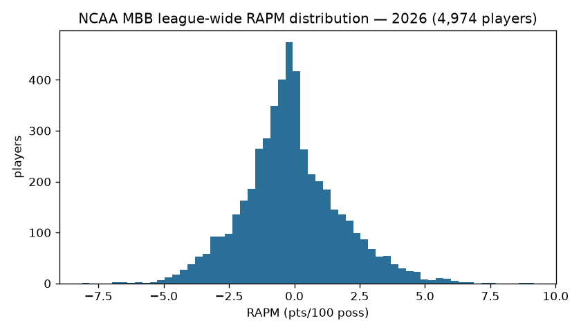
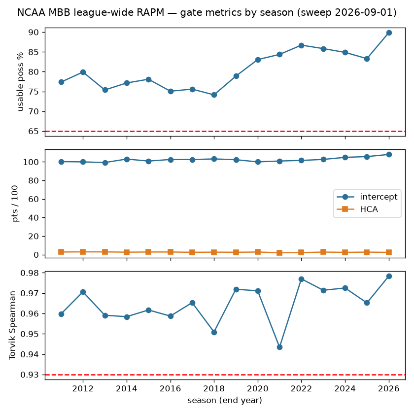
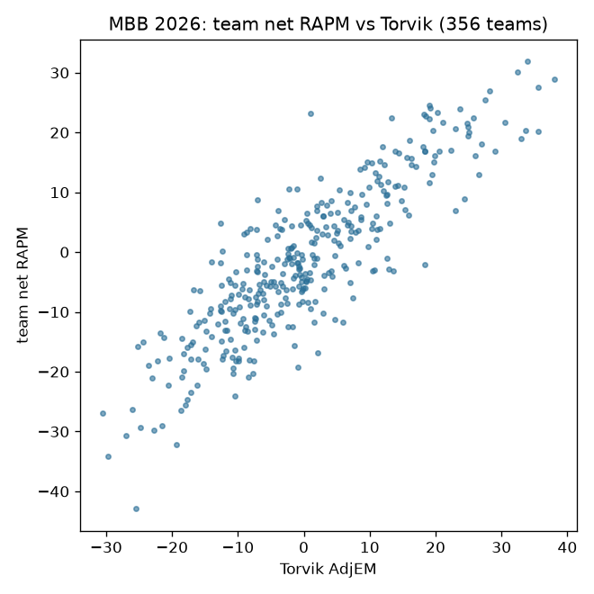

# NCAA MBB RAPM — model documentation

Two deliberately different estimands, published on separate tags (never merge):

| estimand | tag | assets | stage |
|---|---|---|---|
| League-wide (Path B — every D-I player on one scale) | `ncaa_mbb_rapm` | 52 per-season parquet | `python/ncaa_mbb_model_01_rapm_league.py` |
| Within-team (Path A — apportions one team's performance) | `ncaa_mbb_rapm_within_team` | 55 per-season parquet | `python/ncaa_mbb_model_02_rapm_within_team.py` |

## Features / design

Ridge regression (`lambda = 1000`) over the possession-level on/off design
matrix built from this repo's published `possessions` + `team_rosters` +
`name_changes` trees (league-wide) or the raw-bundle lineup reconstruction via
the sdv-py hoop-explorer engine (within-team). Seasons 2011-2026; 2010 is
excluded by the usable-possession gate, not by a season list.

## Gates + observed results (frozen from the 2026-08-24 full validation sweep)

Publish-blocking — a failed season writes NOTHING; floors may only be RAISED
(`--min-spearman` refuses lower values):

| gate | floor | observed |
|---|---|---|
| usable-possession fraction | >= 0.65 | 2011+ min 0.7414 |
| intercept era band (scale-bug catcher) | [95, 112] | 99.24-107.97 |
| home-court advantage band | [1.0, 4.0] | in-band all seasons |
| Torvik external (league-wide only) | >= 250 joined teams AND Spearman(team_net, adjem) >= 0.93 | min 0.9434 |

Within-team has NO Torvik gate (different estimand, not comparable); its shape
is proven by the committed sdv-py e2e lineup-aggregation test. Oracle fixture:
`ops/oracle/ncaa_mbb_torvik.parquet` — a NaN rho or missing oracle season is a
FAILURE, never a skip.

## Operability

League-wide retrain: `.github/workflows/ncaa_mbb_models.yml` (dispatch +
annual post-season cron). Within-team stays manual by design (needs the raw
HTML bundle checkout). Each run appends `models/ledger.jsonl`. Single home for
the stage list: `models/manifest.yaml`.

## Data

Inputs are this repo's own published trees: `possessions` (the stint-level
frame the NCAA hoops engine compiles from raw stats.ncaa.org bundles),
`team_rosters`, and `name_changes` (the person-identity bridge that keeps a
player one column across transfers and name variants). Seasons 2011-2026;
2010 exists upstream but fails the usable-possession gate and is excluded by
the gate rather than a hand list.

## Methodology

**League-wide (Path B).** One design matrix over every D-I possession: each
row is a possession, each player an on/off column (+1 offense, -1 defense),
plus intercept and home-court terms. Ridge regression with `lambda = 1000`
shrinks low-minute players toward zero rather than dropping them; the
regularization strength was fixed by the 2026-08 validation program (the
`lambda` no-op incident is why the fitted value is asserted, not assumed).
Offensive and defensive components are estimated jointly; `rapm = o + d` on
the points-per-100-possessions scale.

**Within-team (Path A)** answers a different question — how one team's
performance apportions across its own players — via the sdv-py hoop-explorer
engine's lineup buckets rebuilt from the raw parse chain. The two estimands
cross-check each other and are published on separate tags; every row carries
an `estimand` column so they can never be silently conflated.

## Feature engineering

The engineering is in the possession construction, not the regression:
substitution-window stint building, possession trimming (the usable-possession
gate measures exactly how much of a season survives), free-throw and
end-of-period edge handling, and the `name_changes` identity bridge. The
intercept and HCA estimates double as **scale-bug catchers** — a wrong
points-per-possession normalization moves them out of band even when the
player ordering (what Spearman sees) survives.

## Limitations

RAPM is a retrodictive on/off estimate: low-minute players shrink heavily
toward zero, multicollinearity between players who always share the floor is
resolved only by the prior, and the external Torvik gate validates TEAM-level
aggregation, not individual ordering. Within-team values are not comparable
across teams by construction.

## Reproducibility

```sh
scripts/ncaa_mbb_models.sh 01           # league-wide, all seasons + gates
python python/ncaa_mbb_model_01_rapm_league.py --season 2026
```

Every run appends `models/ledger.jsonl`; publish is a separate deliberate
step (`ops/publish_rapm_league.py`). CI: `.github/workflows/ncaa_mbb_models.yml`.

## Per-season results (real local sweep, 2026-09-01)

| season | usable % | players | intercept | HCA | Torvik rho (n) |
|---|---|---|---|---|---|
| 2011 | 77.38 | 4482 | 100.24 | 2.805 | 0.9598 (332) |
| 2012 | 79.90 | 4537 | 99.98 | 3.001 | 0.9706 (333) |
| 2013 | 75.38 | 4542 | 99.24 | 2.934 | 0.9591 (334) |
| 2014 | 77.14 | 4671 | 103.00 | 2.639 | 0.9584 (339) |
| 2015 | 78.09 | 4649 | 100.85 | 2.822 | 0.9617 (339) |
| 2016 | 75.07 | 4640 | 102.54 | 2.818 | 0.9587 (339) |
| 2017 | 75.58 | 4630 | 102.45 | 2.505 | 0.9653 (338) |
| 2018 | 74.14 | 4592 | 103.17 | 2.673 | 0.9509 (338) |
| 2019 | 78.87 | 4688 | 102.30 | 2.539 | 0.9719 (338) |
| 2020 | 83.05 | 4626 | 99.98 | 2.787 | 0.9711 (337) |
| 2021 | 84.36 | 4896 | 100.88 | 2.019 | 0.9434 (335) |
| 2022 | 86.70 | 4942 | 101.54 | 2.194 | 0.9770 (346) |
| 2023 | 85.83 | 4942 | 102.61 | 2.736 | 0.9714 (350) |
| 2024 | 84.87 | 4919 | 104.84 | 2.455 | 0.9725 (350) |
| 2025 | 83.30 | 4960 | 105.67 | 2.691 | 0.9652 (353) |
| 2026 | 89.84 | 4974 | 107.97 | 2.435 | 0.9783 (356) |

Card: [`ncaa_mbb_rapm_card.json`](ncaa_mbb_rapm_card.json)

## Figures







## Avenues for improvement & open issues

- **Luck adjustment and archetype priors** — the two known gaps versus the
  strongest public APM systems (catalogued in the APM research corpus): 3P%
  luck-adjusting the target, and informative priors by player archetype
  instead of a flat ridge.
- **Exact standard errors** — the ridge posterior gives per-player SEs almost
  for free; publishing them would turn point estimates into honest intervals.
- **Within-team CI** — Path A still requires the raw HTML bundle checkout;
  a store-backed runner would let it join the wired retrain.
- **Known issue:** multi-year RAPM (stabilizing low-minute players across
  seasons) is unbuilt; single-season estimates stay noisy below ~200
  possessions.
