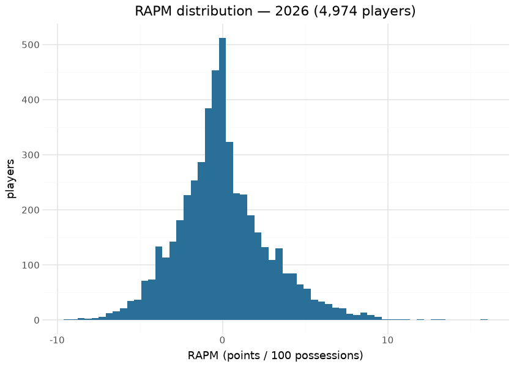
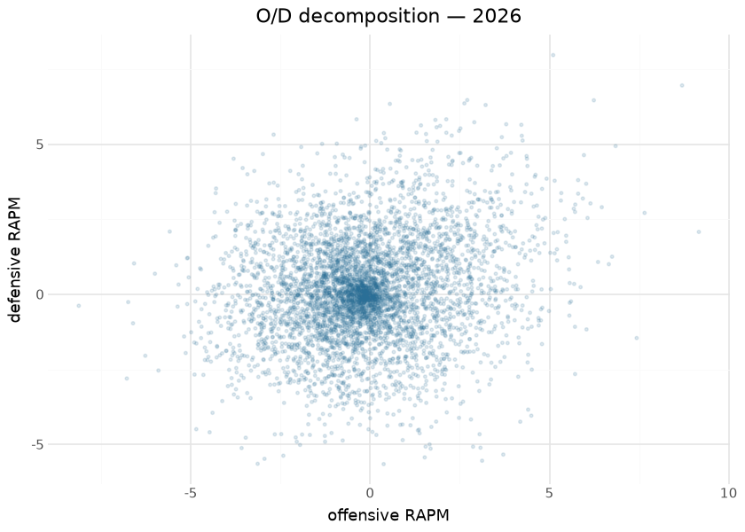
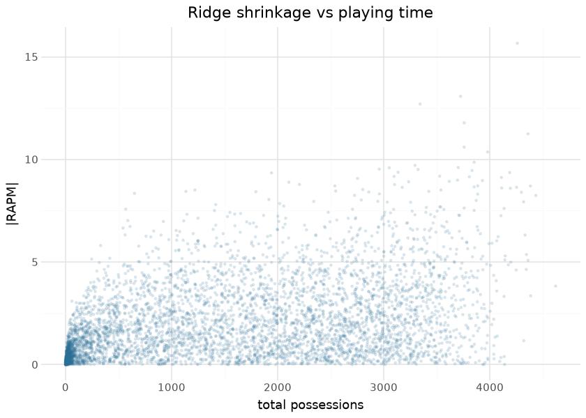
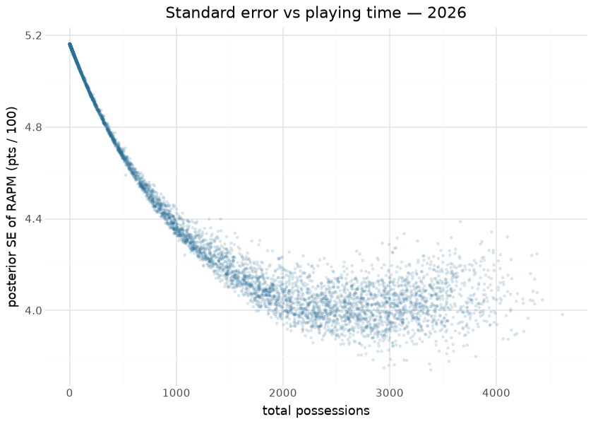
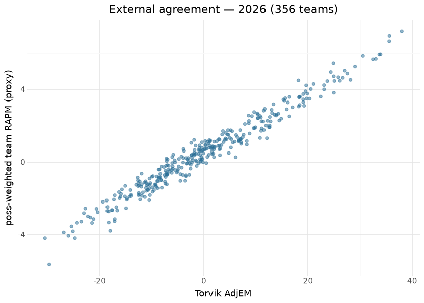

# NCAA MBB RAPM — league-wide and within-team

Two deliberately different RAPM estimands publish from this repository
on separate release tags (never merged): **league-wide**
(`ncaa_mbb_rapm`, Path B — every D-I player on one
points-per-100-possessions scale) and **within-team**
(`ncaa_mbb_rapm_within_team`, Path A — how one team’s performance
apportions across its own players; not comparable across teams by
construction). Every published row carries an `estimand` column so the
two can never be silently conflated. This document is the reproducible
writeup for the league-wide model, computed at render time from the
local sweep outputs (`ops/out_league/`), the committed evaluation card,
and the committed Torvik oracle fixture.

**Model.** Ridge regression (λ = 1000) over the possession-level on/off
design matrix: each row is a possession, each player an on/off column
(+1 offense, −1 defense), plus intercept and home-court terms. Offensive
and defensive components are estimated jointly; `rapm = orapm + drapm`
on the points-per-100 scale. The regularization strength was fixed by
the 2026-08 validation program — and the fitted value is *asserted* at
run time, because the λ no-op incident (a ridge that silently fit
unregularized) is exactly the class of bug that survives rank-based
checks.

**Uncertainty.** Every published row carries `orapm_se`, `drapm_se` and
`rapm_net_se` — the ridge **posterior** standard errors,
`sqrt(σ̂² · diag((XᵀWX + λI)⁻¹))`, with σ̂² the possession-weighted
residual variance on n − df_eff degrees of freedom (df_eff = trace of
the ridge hat matrix) and the net SE including the O/D posterior
covariance. Under the prior the penalty encodes (β ~ N(0, σ²/λ)) this is
a credible interval for the *true* impact: a low-minute player sits at ≈
0 ± σ̂/√λ (≈ ±3.6 per component) and the interval tightens as the data
separate a player from his lineups. The alternative, the frequentist
sandwich covariance σ̂²·M(XᵀWX)M (its SEs are `sqrt` of the diagonal), is
the *repeatability of the shrunk estimate*: it collapses toward 0 for a
player the ridge pins at zero, so it is not an interval for the truth —
but it is exactly what a refit can check, and the producer computes it
as the calibration instrument for the published SEs (see *Uncertainty*
below). The intercept is treated as fixed (its SE is ≈ 0.14 points per
100).

**Feature engineering lives in the possession construction, not the
regression**: substitution-window stint building, possession trimming
(the usable-possession gate measures how much of a season survives),
free-throw and end-of-period edge handling, and the `name_changes`
identity bridge that keeps a player one column across transfers and name
variants. The intercept and home-court estimates double as **scale-bug
catchers** — a wrong points-per-possession normalization moves them out
of band even when the player ordering (what a Spearman gate sees)
survives.

## Training data

| League-wide RAPM corpus, by season |  |  |  |  |  |
|----|----|----|----|----|----|
| players + possessions from the local sweep outputs; usable% / intercept / HCA from the frozen evaluation card |  |  |  |  |  |
| season | players | player_poss | usable | mu | hca |
| 2011 | 4482 | 5,994,840 | 77.38 | 100.24 | 2.81 |
| 2012 | 4537 | 6,170,570 | 79.90 | 99.98 | 3.00 |
| 2013 | 4542 | 5,887,870 | 75.38 | 99.24 | 2.93 |
| 2014 | 4671 | 6,244,830 | 77.14 | 103.00 | 2.64 |
| 2015 | 4649 | 6,133,910 | 78.09 | 100.85 | 2.82 |
| 2016 | 4640 | 6,284,410 | 75.07 | 102.54 | 2.82 |
| 2017 | 4630 | 6,391,860 | 75.58 | 102.45 | 2.50 |
| 2018 | 4592 | 6,286,390 | 74.14 | 103.17 | 2.67 |
| 2019 | 4688 | 6,669,340 | 78.87 | 102.30 | 2.54 |
| 2020 | 4626 | 6,776,490 | 83.05 | 99.98 | 2.79 |
| 2021 | 4896 | 5,091,020 | 84.36 | 100.88 | 2.02 |
| 2022 | 4942 | 7,197,890 | 86.70 | 101.54 | 2.19 |
| 2023 | 4942 | 7,408,220 | 85.83 | 102.61 | 2.74 |
| 2024 | 4919 | 7,402,980 | 84.87 | 104.84 | 2.46 |
| 2025 | 4960 | 7,275,190 | 83.30 | 105.67 | 2.69 |
| 2026 | 4974 | 7,889,700 | 89.84 | 107.97 | 2.44 |

&#10;

Inputs are this repository’s own published trees: `possessions` (the
stint-level frame the NCAA hoops engine compiles from raw stats.ncaa.org
bundles), `team_rosters`, and `name_changes`. Seasons 2011–2026; 2010
exists upstream but fails the usable-possession gate and is excluded by
the gate rather than a hand list.

## Exploratory data analysis

## Attribution

There is no SHAP section here, and deliberately so: in an on/off design
the “features” are the players themselves, so the fitted coefficients
*are* the attributions — each player’s RAPM is exactly their estimated
marginal effect on a possession’s outcome, jointly with everyone else’s.
The O/D scatter above is the model’s native attribution decomposition,
and the shrinkage plot shows the prior doing the work SHAP would
otherwise reveal: low-minute players carry near-zero attributed effect
because the data cannot separate them from their lineups.

## Uncertainty

| Median posterior SE by possession decile — 2026 |  |  |  |  |
|----|----|----|----|----|
| decile 0 = fewest possessions; the prior SD σ̂/√λ is the ceiling, the collinearity floor the plateau |  |  |  |  |
| decile | n | poss_min | poss_max | median_rapm_net_se |
| 0 | 498 | 1 | 47 | 5.139 |
| 1 | 497 | 47 | 235 | 5.026 |
| 2 | 498 | 236 | 608 | 4.749 |
| 3 | 497 | 609 | 1,044 | 4.459 |
| 4 | 497 | 1,046 | 1,517 | 4.263 |
| 5 | 498 | 1,517 | 1,966 | 4.110 |
| 6 | 497 | 1,966 | 2,408 | 4.023 |
| 7 | 498 | 2,408 | 2,822 | 4.011 |
| 8 | 497 | 2,823 | 3,257 | 4.020 |
| 9 | 497 | 3,260 | 4,620 | 4.050 |

&#10;

The published SE is validated on every season by a **split-half refit**:
the season’s games are split by the parity of `contest_id`
(deterministic and roster-neutral — the halves differ by sampling noise,
not by the development or transfer drift a date split would add), both
halves are refit, and each player rated in both is checked for \|β̂ₐ −
β̂ᵦ\| ≤ 2·sqrt(SEₐ² + SEᵦ²). Under the **sampling** SE this is the
textbook calibration test and the coverage sits at the 0.954 nominal in
every season — σ̂², the inverse and the O/D covariance are right.

Under the published **posterior** SE the same test returns ≈ 1.0
coverage with a standardised-difference SD of ≈ 0.38 rather than 1.0.
Read that plainly: **the published SE is conservative by ≈ 2.5×** (≈
2.3× for 1,000-plus-possession players) relative to how much the
estimate actually moves between two halves of a season. That is not a
defect — at λ = 1000 the fit is prior-dominated, and a credible interval
for the *true* impact is legitimately wider than the *repeatability* of
a shrunk estimate — but it means the posterior coverage number is a
one-sided guard against SEs that silently shrank, never evidence of
nominal calibration.

**What to do with it.** Use `rapm_net ± 2·rapm_net_se` as a deliberately
cautious band: if it excludes zero the player is separated from the
prior by the data, and overlapping bands (as in the leaders table below)
mean a tier, not a ranking. Do NOT read it as the season-to-season or
half-to-half wobble of the number — that spread is ≈ 2.5× tighter, and a
consumer propagating the published SE into a difference-of-two-players
test will be materially over-conservative.

| Standard-error gates by season — frozen from the 2026-09-01 sweep (evaluation card) |  |  |  |  |  |  |  |  |  |
|----|----|----|----|----|----|----|----|----|----|
| split-half = odd vs even games; coverage = share of players whose other-half estimate lies within 2·sqrt(SE_A² + SE_B²); z-sd = SD of the standardised difference (1.0 when calibrated) |  |  |  |  |  |  |  |  |  |
| season | σ̂² | ρ(poss, SE) | SE dec 0 | SE dec 9 | cov (posterior) | cov O (sampling) | cov D (sampling) | cov net (sampling) | z-sd (sampling) |
| 2011 | 12,562 | −0.930 | 4.99 | 3.98 | 1.000 | 0.959 | 0.958 | 0.960 | 0.980 |
| 2012 | 12,613 | −0.925 | 5.00 | 3.99 | 1.000 | 0.952 | 0.952 | 0.951 | 1.023 |
| 2013 | 12,583 | −0.937 | 5.00 | 4.00 | 1.000 | 0.951 | 0.951 | 0.950 | 1.011 |
| 2014 | 12,591 | −0.935 | 5.00 | 3.98 | 1.000 | 0.951 | 0.952 | 0.956 | 0.987 |
| 2015 | 12,691 | −0.925 | 5.01 | 4.03 | 1.000 | 0.952 | 0.951 | 0.949 | 1.009 |
| 2016 | 12,771 | −0.934 | 5.03 | 3.99 | 1.000 | 0.951 | 0.955 | 0.951 | 1.000 |
| 2017 | 12,871 | −0.927 | 5.05 | 4.01 | 1.000 | 0.954 | 0.948 | 0.954 | 1.008 |
| 2018 | 13,107 | −0.929 | 5.10 | 4.06 | 1.000 | 0.957 | 0.951 | 0.954 | 1.006 |
| 2019 | 13,176 | −0.924 | 5.12 | 4.05 | 1.000 | 0.955 | 0.954 | 0.954 | 1.011 |
| 2020 | 12,986 | −0.902 | 5.08 | 4.05 | 1.000 | 0.953 | 0.952 | 0.953 | 1.003 |
| 2021 | 13,112 | −0.965 | 5.11 | 4.12 | 1.000 | 0.954 | 0.952 | 0.947 | 1.028 |
| 2022 | 13,123 | −0.917 | 5.11 | 4.05 | 1.000 | 0.954 | 0.957 | 0.955 | 1.004 |
| 2023 | 13,098 | −0.910 | 5.10 | 4.04 | 1.000 | 0.952 | 0.954 | 0.948 | 1.014 |
| 2024 | 13,212 | −0.913 | 5.12 | 4.05 | 1.000 | 0.947 | 0.956 | 0.952 | 1.016 |
| 2025 | 13,290 | −0.921 | 5.14 | 4.06 | 1.000 | 0.955 | 0.949 | 0.948 | 1.028 |
| 2026 | 13,332 | −0.898 | 5.14 | 4.05 | 1.000 | 0.950 | 0.949 | 0.952 | 1.019 |

&#10;

## Evaluation

Two layers, both real. First, the **frozen gates from the 2026-08-24
full validation sweep** (gates 1–4) and the **2026-09-01 standard-error
sweep** (gate 5) — publish-blocking (a failed season writes NOTHING;
floors may only be raised):

| gate | floor | observed (sweep) |
|----|----|----|
| usable-possession fraction | ≥ 0.65 | 2011+ min 0.7414 |
| intercept era band (scale-bug catcher) | \[95, 112\] | 99.24–107.97 |
| home-court advantage band | \[1.0, 4.0\] | in-band all seasons |
| σ̂² era band (SE scale-bug catcher) | \[11000, 15000\] | 12,562–13,332 |
| Spearman(possessions, rapm_net_se) | ≤ −0.80 | −0.965 to −0.898 |
| top-decile median SE \< bottom-decile median SE | strict | ratio 0.788–0.807 |
| split-half coverage, posterior SE (rapm_net) | ≥ 0.95 | ≥ 0.9995 |
| split-half coverage, sampling SE (O, D, net) | \[0.92, 0.98\] | 0.9465–0.9601 |
| Torvik external (league-wide only) | ≥ 250 joined teams AND Spearman(team_net, adjem) ≥ 0.93 | min 0.9434 |

| Per-season gate results — frozen from the validation sweep (evaluation card) |  |  |  |  |  |  |
|----|----|----|----|----|----|----|
| rho = Spearman(team_net, Torvik AdjEM) on n joined teams; the possession-weighted stint aggregate the gate uses |  |  |  |  |  |  |
| season | usable | players | mu | hca | rho | n |
| 2011 | 77.38 | 4482 | 100.24 | 2.81 | 0.9598 | 332 |
| 2012 | 79.90 | 4537 | 99.98 | 3.00 | 0.9706 | 333 |
| 2013 | 75.38 | 4542 | 99.24 | 2.93 | 0.9591 | 334 |
| 2014 | 77.14 | 4671 | 103.00 | 2.64 | 0.9584 | 339 |
| 2015 | 78.09 | 4649 | 100.85 | 2.82 | 0.9617 | 339 |
| 2016 | 75.07 | 4640 | 102.54 | 2.82 | 0.9587 | 339 |
| 2017 | 75.58 | 4630 | 102.45 | 2.50 | 0.9653 | 338 |
| 2018 | 74.14 | 4592 | 103.17 | 2.67 | 0.9509 | 338 |
| 2019 | 78.87 | 4688 | 102.30 | 2.54 | 0.9719 | 338 |
| 2020 | 83.05 | 4626 | 99.98 | 2.79 | 0.9711 | 337 |
| 2021 | 84.36 | 4896 | 100.88 | 2.02 | 0.9434 | 335 |
| 2022 | 86.70 | 4942 | 101.54 | 2.19 | 0.9770 | 346 |
| 2023 | 85.83 | 4942 | 102.61 | 2.74 | 0.9714 | 350 |
| 2024 | 84.87 | 4919 | 104.84 | 2.46 | 0.9725 | 350 |
| 2025 | 83.30 | 4960 | 105.67 | 2.69 | 0.9652 | 353 |
| 2026 | 89.84 | 4974 | 107.97 | 2.44 | 0.9783 | 356 |

&#10;

Second, a **render-time external check** against the committed Torvik
oracle fixture. The gate’s own `team_net` is a possession-weighted stint
aggregate that needs the full stint frame; this document computes the
closest player-level proxy — each team’s possession-weighted mean of
player RAPM — and holds it against Torvik AdjEM. It is labeled a proxy
precisely because it is not the gate’s aggregate; its job is to show the
external agreement reproduces from the committed artifacts alone:

| Render-time external check — possession-weighted player-RAPM proxy vs Torvik AdjEM |  |  |
|----|----|----|
| proxy aggregate (not the gate's stint-weighted team_net); computed from committed artifacts on every render |  |  |
| season | joined_teams | proxy_spearman |
| 2011 | 332 | 0.9596 |
| 2012 | 333 | 0.9706 |
| 2013 | 334 | 0.9591 |
| 2014 | 339 | 0.9581 |
| 2015 | 339 | 0.9616 |
| 2016 | 339 | 0.9590 |
| 2017 | 338 | 0.9653 |
| 2018 | 338 | 0.9510 |
| 2019 | 338 | 0.9720 |
| 2020 | 337 | 0.9711 |
| 2021 | 335 | 0.9434 |
| 2022 | 346 | 0.9770 |
| 2023 | 350 | 0.9715 |
| 2024 | 350 | 0.9726 |
| 2025 | 353 | 0.9654 |
| 2026 | 356 | 0.9783 |

&#10;

## Results

| Top 15 league-wide RAPM — 2026 (min 800 possessions) |  |  |  |  |  |  |  |  |
|----|----|----|----|----|----|----|----|----|
| points per 100 possessions; SE = posterior standard error, interval = RAPM ± 2·SE; no public headshot CDN exists for stats.ncaa.org player ids |  |  |  |  |  |  |  |  |
| Player | Team | Poss | O-RAPM | D-RAPM | RAPM | SE | 95% lo | 95% hi |
| YAXEL.LENDEBORG | Michigan | 4,259 | 8.70 | 6.96 | 15.66 | 3.91 | 7.84 | 23.47 |
| FLORY.BIDUNGA | Kansas | 3,724 | 5.10 | 7.97 | 13.07 | 4.01 | 5.05 | 21.10 |
| HENRI.VEESAAR | North Carolina | 3,342 | 6.24 | 6.47 | 12.70 | 4.02 | 4.67 | 20.73 |
| MJ.COLLINS | Utah St. | 3,758 | 6.84 | 4.94 | 11.78 | 3.97 | 3.84 | 19.73 |
| JAKOBI.GILLESPIE | Tennessee | 4,360 | 9.17 | 2.08 | 11.25 | 4.03 | 3.19 | 19.30 |
| FLETCHER.LOYER | Purdue | 3,758 | 5.96 | 4.64 | 10.60 | 4.06 | 2.47 | 18.73 |
| KEATON.WAGLER | Illinois | 3,979 | 7.65 | 2.71 | 10.37 | 4.05 | 2.26 | 18.47 |
| JEREMY.FEARS | Michigan St. | 3,852 | 4.21 | 5.65 | 9.86 | 4.14 | 1.58 | 18.15 |
| ROBBIE.AVILA | Saint Louis | 3,295 | 6.02 | 3.68 | 9.71 | 4.07 | 1.57 | 17.84 |
| JOSHUA.JEFFERSON | Iowa St. | 3,702 | 5.80 | 3.81 | 9.60 | 3.89 | 1.82 | 17.39 |
| DAME.SARR | Duke | 2,957 | 3.22 | 6.31 | 9.53 | 3.88 | 1.77 | 17.28 |
| IZAIYAH.NELSON | South Fla. | 3,323 | 4.23 | 5.28 | 9.51 | 4.01 | 1.50 | 17.53 |
| MILAN.MOMCILOVIC | Iowa St. | 3,832 | 3.79 | 5.67 | 9.46 | 3.93 | 1.60 | 17.32 |
| TREY.MCKENNEY | Michigan | 3,135 | 4.25 | 5.12 | 9.38 | 3.78 | 1.81 | 16.94 |
| CAMERON.BOOZER | Duke | 4,187 | 6.46 | 2.90 | 9.36 | 4.04 | 1.28 | 17.44 |

&#10;

RAPM is a retrodictive on/off estimate: low-minute players shrink
heavily toward zero, multicollinearity between players who always share
the floor is resolved only by the prior, and the external Torvik gate
validates TEAM-level aggregation, not individual ordering — which is why
the results table applies a possession floor before ranking anyone. The
intervals make the point directly: the top-15 bands overlap almost
entirely, so the table is a tier, not a ranking.

## Provenance & reproducibility

- **Trained on:** this repository’s published `possessions` +
  `team_rosters` + `name_changes` trees, seasons 2011–2026 (2010
  excluded by the usable-possession gate).
- **Model:** ridge (λ = 1000, asserted at run time) via the sdv-py
  `mbb_ncaa_rapm_league` engine; league-wide stage
  `python/ncaa_mbb_model_01_rapm_league.py`, within-team stage
  `python/ncaa_mbb_model_02_rapm_within_team.py` (manual by design —
  needs the raw HTML bundle checkout).
- **Standard errors:** posterior `sqrt(σ̂²·diag((XᵀWX+λI)⁻¹))` from one
  dense Cholesky inverse of the (2P+1)-square penalised Gram matrix
  (≈10k, seconds); the sampling SE `sqrt(diag(σ̂²(M − λM²)))` —
  `σ̂²(M − λM²)` is the sampling COVARIANCE matrix — comes from the same
  inverse and drives the split-half calibration gate (gate 5). Engine:
  sdv-py `mbb_ncaa_rapm_league.solve_rapm_league` /
  `split_half_se_check`.
- **Gates:** frozen in the table above; oracle fixture
  `ops/oracle/ncaa_mbb_torvik.parquet` (a NaN rho or missing oracle
  season is a FAILURE, never a skip). Runs append `models/ledger.jsonl`;
  publish is a separate deliberate step (`ops/publish_rapm_league.py`).
- **Retrain:** `scripts/ncaa_mbb_models.sh 01` /
  `.github/workflows/ncaa_mbb_models.yml` (dispatch + annual post-season
  cron). Single home: `models/manifest.yaml`.
- **Rebuild this document:** `scripts/render_model_docs.sh` (Quarto →
  GFM; `uv sync --group docs`); reads only committed/local artifacts —
  fully offline.

## Avenues for improvement & open issues

- **Luck adjustment** — 3P% luck-adjusting the target is still open (the
  other half of this item, informative priors instead of a flat ridge,
  is answered by the SPM-prior result below).
- **Resolved (2026-09-01, PR \#19):** exact standard errors — the ridge
  posterior SEs are published as `orapm_se` / `drapm_se` /
  `rapm_net_se`, validated by a split-half calibration gate (sampling-SE
  coverage at the 0.954 nominal in every season) and shown as ±2·SE
  intervals above. Finding worth keeping: at λ = 1000 the posterior SE
  is ≈2.3× the estimate’s repeatability even for 4,000-possession
  players — the prior, not the data, sets most of the interval.
- **Within-team CI** — Path A still requires the raw HTML bundle
  checkout; a store-backed runner would let it join the wired retrain.
- **Resolved (2026-09-02, PR \#21):** multi-year RAPM is built and
  **measured**, and the premise this item was written on turned out to
  be wrong. A decayed-weight stacked design (seasons *t−2…t* in one fit,
  columns keyed by the cross-season `person_id`, season *s* weighted
  `decay^(t−s)` with `decay = 0.5`, each season offset to *t*’s scoring
  level) beats the single-season baseline on out-of-sample game-margin
  MAE by **0.095 points per game** over 13,081 held-out games, better in
  10/10 seasons, pooled game-cluster bootstrap 95% CI excluding zero.
  Next-season Spearman for returning players rises 0.3115 → 0.3300.
  **But the gain is NOT concentrated in the low-possession tail.** The
  absolute Spearman gain is flat across playing time — +0.022 in the
  \<100-possession bin and +0.022 in the 1500+ bin — so there is no
  possession threshold above which it stops helping. It is a uniform
  variance reduction, not a tail stabiliser. The *relative* gain is
  largest in the tail only because the baseline is near zero there
  (0.0261 → 0.0486 for \<200 possessions vs 0.3777 → 0.3984 for 1000+);
  those are different claims and should not be conflated. **Not wired
  into this producer yet, on purpose:** pooling changes what `σ̂²`
  measures (weighted residual variance under decay weights — measured
  7,733 vs the single-season 13,212 against a publish-blocking gate band
  of \[11000, 15000\]), so the estimator flip needs its own re-derived
  band plus a season-*t* filter on the published frame, and it
  republishes 52 live assets.
- **SPM-prior RAPM (2026-09-02, PR \#21) — measured, engine support
  shipped, not yet the producer default.** Shrinking toward a box-score
  plus/minus estimate instead of toward zero
  (`solve_rapm_league(prior_mean=…)`, a re-centring that leaves λ and
  every `*_se` column untouched) is worth **0.061 points per game** of
  margin error out-of-sample and lifts next-season Spearman 0.3115 →
  0.3466; combined with multi-year it is **0.135** and 0.3598. It has a
  real threshold at roughly **100 possessions**: +0.03…+0.06 Spearman in
  every bin above it, and +0.003 below it — under ~100 possessions a
  player’s box *rates* are themselves noise, so the prior is a
  confident-looking centre made of noise. Exposure shrink
  `poss/(poss+k)` with `k = 100` was chosen on held-out development
  seasons. Full pre-registered design, all three criteria, and the
  leakage boundaries: `ops/experiments/rapm_stabilization.py`
  (re-runnable) and the ClaudeCowork ledger
  `2026-09-01-writeup-improvements/reports/rapm-stabilization.md`.
